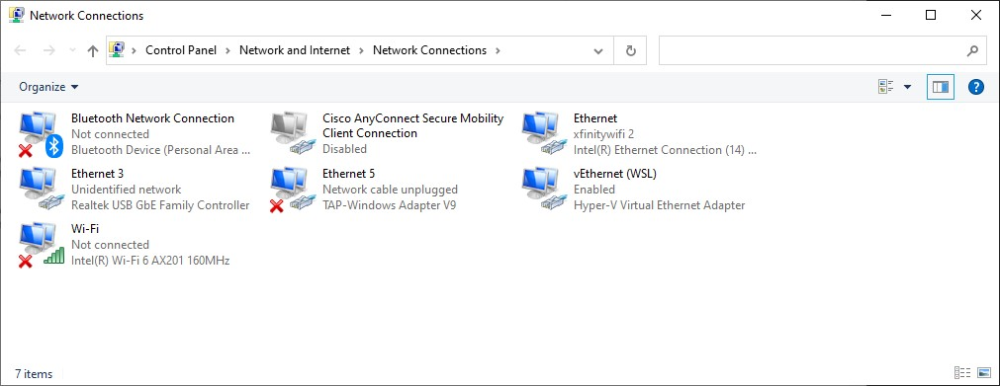
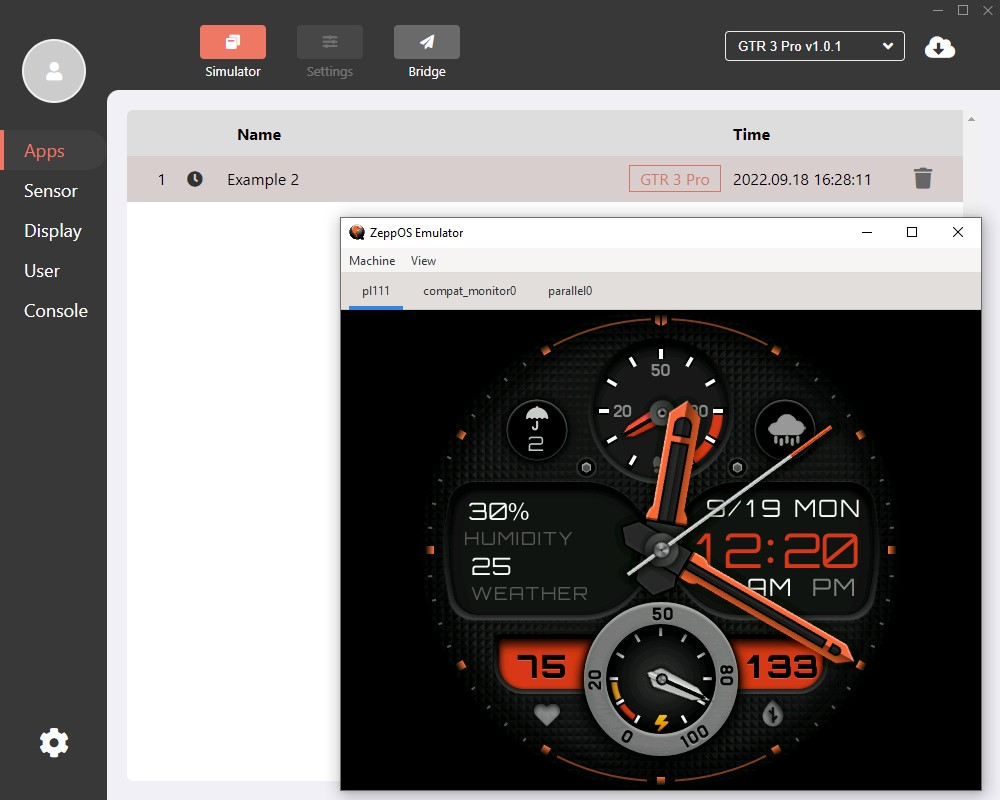
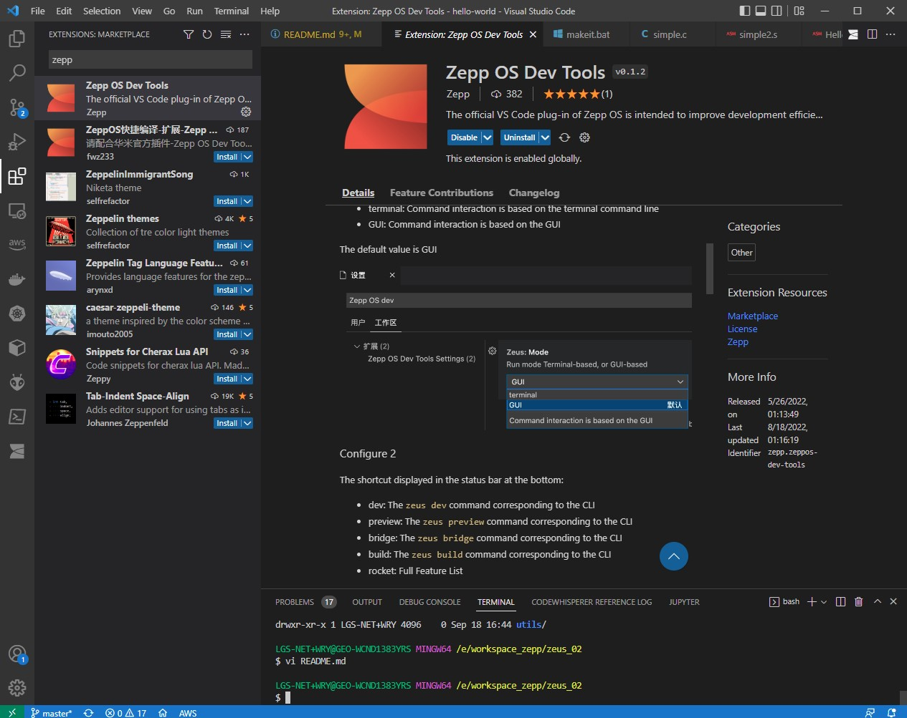
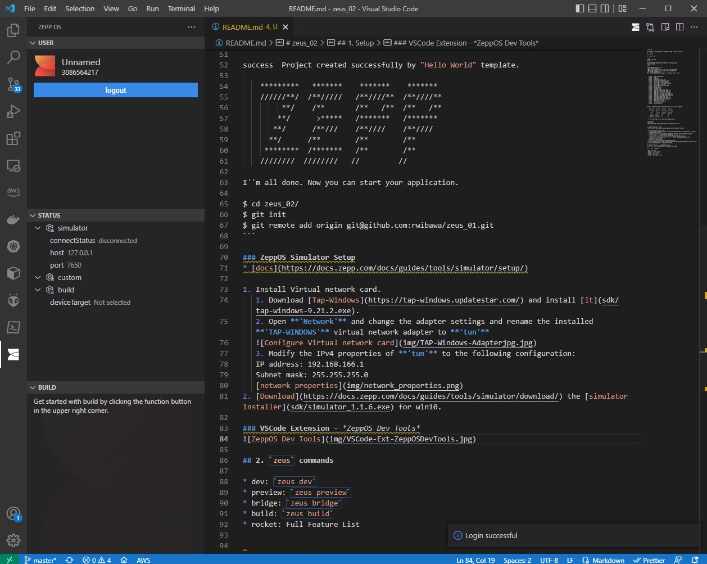
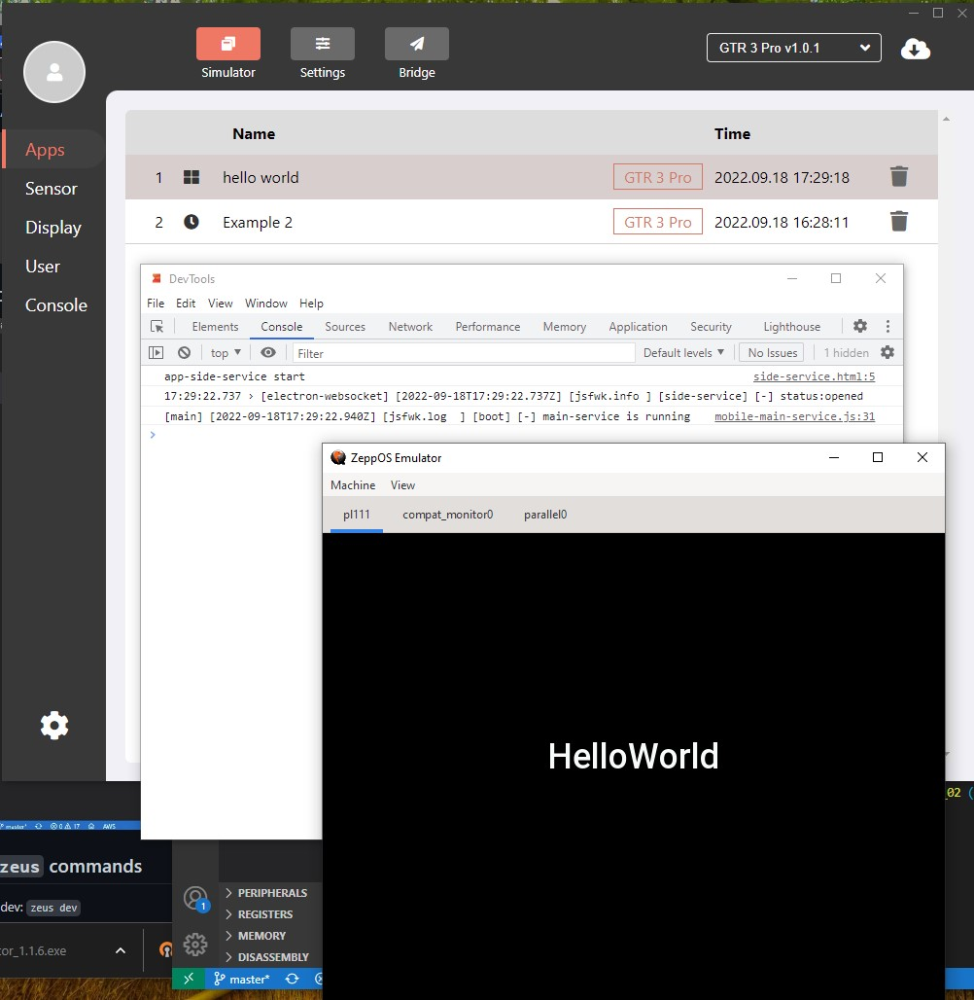

# zeus_02

Use ZeppOS to develop app for my Amazfit Band 5 device on win10.

## 1. Setup

### `zeus` tool

```sh
$ node --version
v16.13.0

$ npm --version
8.1.0

$ npm i @zeppos/zeus-cli -g

$ zeus create zeus_02
? What type of application do you want to create? APP    
? Which app template do you want to use? Hello World
info  fetching template...
info  Create application using local template "Hello World".


   create   \app-side\index.js
   create   \app.js
   create   \app.json
   create   \assets\gtr3\icon.png
   create   \assets\gtr3\image\logo.png
   create   \assets\gtr3-pro\icon.png
   create   \assets\gtr3-pro\image\logo.png
   create   \assets\gts3\icon.png
   create   \assets\gts3\image\logo.png
   create   \global.d.ts
   create   \jsconfig.json
   create   \package.json
   create   \page\gtr3\home\index.page.js
   create   \page\gtr3\home\index.page.json
   create   \page\gtr3\home\index.style.js
   create   \page\gtr3-pro\home\index.page.js
   create   \page\gtr3-pro\home\index.page.json
   create   \page\gtr3-pro\home\index.style.js
   create   \page\gts3\home\index.page.js
   create   \page\gts3\home\index.page.json
   create   \page\gts3\home\index.style.js
   create   \page\i18n\en-US.po
   create   \setting\i18n\en-US.po
   create   \setting\index.js
   create   \utils\index.js


success  Project created successfully by "Hello World" template.

    *********   *******    *******    ******* 
    //////**/  /**/////   /**////**  /**////**
         **/    /**       /**   /**  /**   /**
        **/      >*****   /*******   /******* 
       **/      /**///    /**////    /**////  
      **/      /**        /**        /**      
     ********  /*******   /**        /**      
    ////////  ////////   //         //       

I''m all done. Now you can start your application.

$ cd zeus_02/
$ git init
$ git remote add origin git@github.com:rwibawa/zeus_02.git
$ npm i @zeppos/zeus-cli -S
```

### ZeppOS Simulator Setup

* [docs](https://docs.zepp.com/docs/guides/tools/simulator/setup/)

1. Install Virtual network card.
   1. Download [Tap-Windows](https://tap-windows.updatestar.com/) and install [it](sdk/tap-windows-9.21.2.exe).
   2. Open **'Network'** and change the adapter settings and rename the installed **'TAP-WINDOWS'** virtual network adapter to **'tun'**
   
   3. Modify the IPv4 properties of **'tun'** to the following configuration:
   IP address: 192.168.166.1
   Subnet mask: 255.255.255.0
   [network properties](img/network_properties.png)
2. [Download](https://docs.zepp.com/docs/guides/tools/simulator/download/) the [simulator installer](sdk/simulator_1.1.6.exe) for win10.
3. Simulator bridge configuration:
host: 127.0.0.1
port: 7650


### VSCode Extension - *ZeppOS Dev Tools*




## 2. `zeus` commands

* dev: `zeus dev`
* preview: `zeus preview`
* bridge: `zeus bridge`
* build: `zeus build`
* rocket: Full Feature List

```sh
$ zeus dev
? simulator host (127.0.0.1): 127.0.0.1
? Which target would you like to preview? gtr3-pro
info  connecting to simulator
rebuilding...
success  simulator connected
rebuild done
refreshing simulator...
watching the changes in this project...
```

Output:

